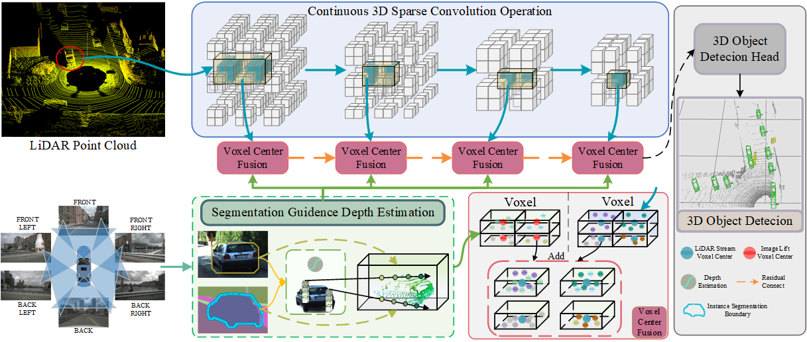
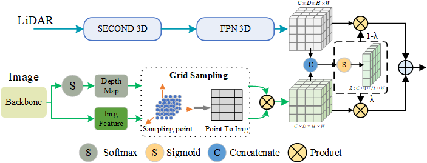

# DLFusion repository

PyTorch implementation of DLFusion for  paper DLFusion: Painting-Depth Augmenting-LiDAR for Multimodal Fusion 3D Object Detection. (For now, we have released the code of the part of appendix)

Surround-view cameras combined with image depth transformation to 3D feature space and fusion with point cloud features are highly regarded. The transformation of 2D features into 3D feature space by means of predefined sampling points and depth distribution happens throughout the scene, and this process generates a large number of redundant features. In addition, multimodal feature fusion unified in 3D space often happens in the previous step of the downstream task, ignoring the interactive fusion between different scales. To this end, we design a new framework, focusing on the design that can give 3D geometric perception information to images and unify them into voxel space to accomplish multi-scale interactive fusion, and we mitigate feature alignment between modal features by geometric relationships between voxel features. The method has two main designs. First, a Segmentation-guided Image View Transformation module is used to accurately transform the pixel region containing the object into a 3D pseudo-point voxel space with the help of a depth distribution. This allows subsequent feature fusion to be performed in a unified voxel feature. Secondly, a Voxel-centric Consistent Fusion module is used to alleviate the errors caused by depth estimation, as well as to achieve better feature fusion between unified modalities. Our proposed method is referred to as DLFusion. Through extensive experiments on the KITTI and nuScenes datasets, we validate the effectiveness of our camera-LIDAR fusion method. Our proposed approach shows competitive performance on both datasets and outperforms state-of-the-art methods in certain classes of 3D object detection benchmarks.

# Main Text

# Appendix

Appendix part of the code is released

## Use DLFusion

**Installation**

Please refer to [getting_started.md](docs/getting_started.md) for installation of mmdet3d. We use mmdet 2.10.0 and mmcv 1.2.4 for this project.

**Benchmark Evaluation and Training**

Please refer to [data_preparation.md](docs/data_preparation.md) to prepare the data. Then follow the instruction there to train our model. All detection configurations are included in [configs](configs/).

## Acknowlegement

We sincerely thank the authors of [mmdetection3d](https://github.com/open-mmlab/mmdetection3d), [CenterPoint](https://github.com/tianweiy/CenterPoint), [BEVFormer](https://github.com/zhiqi-li/BEVFormer), [Caddn](https://github.com/TRAILab/CaDDN), [PETR](https://github.com/megvii-research/PETR) for open sourcing their methods.
